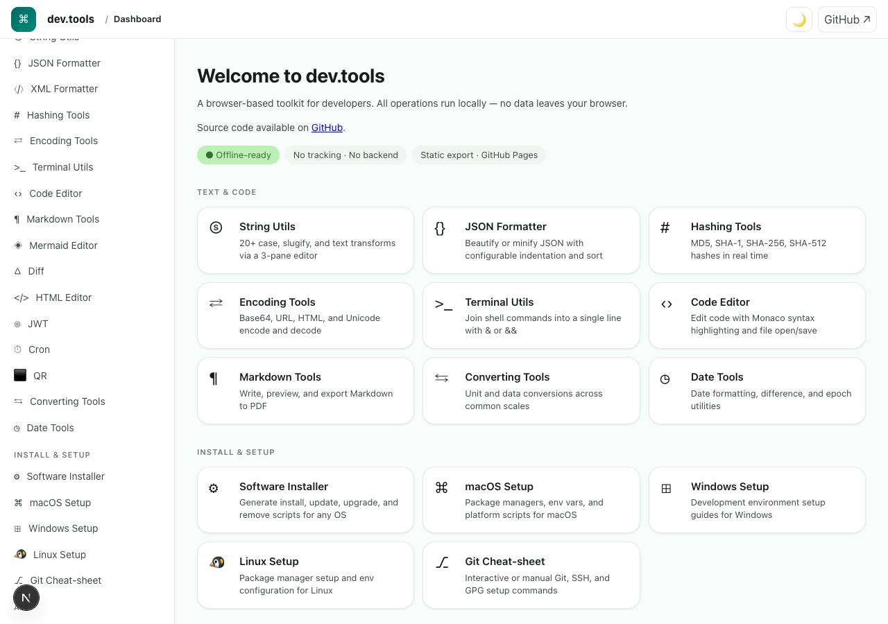
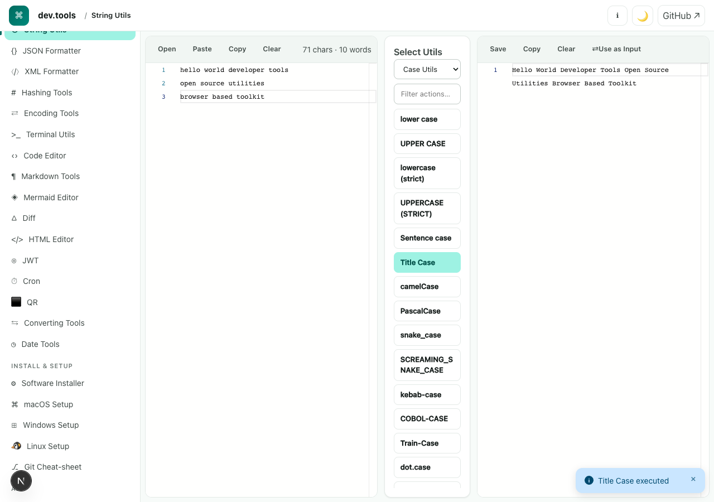
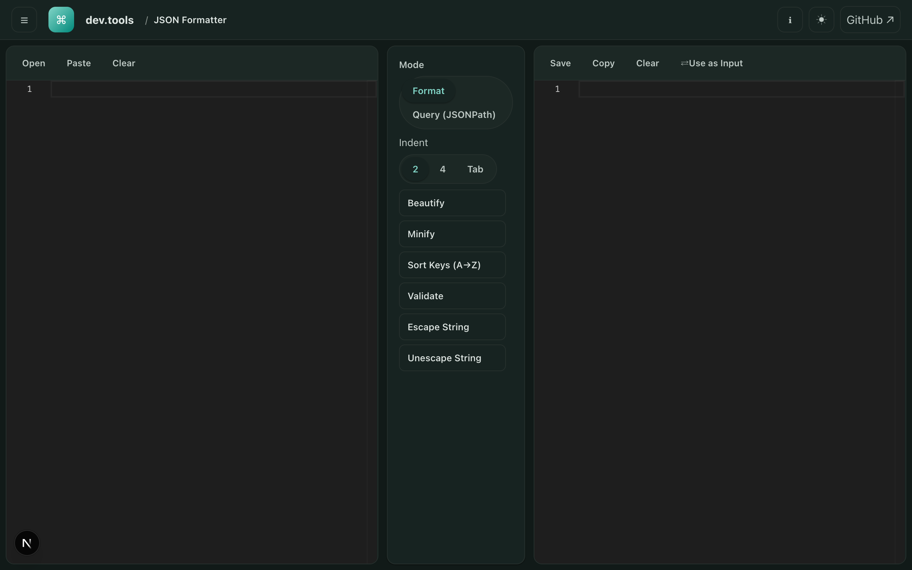
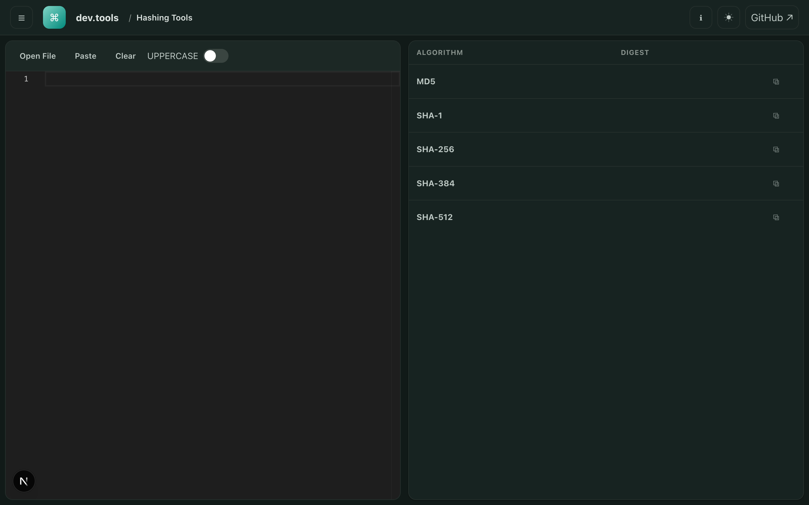
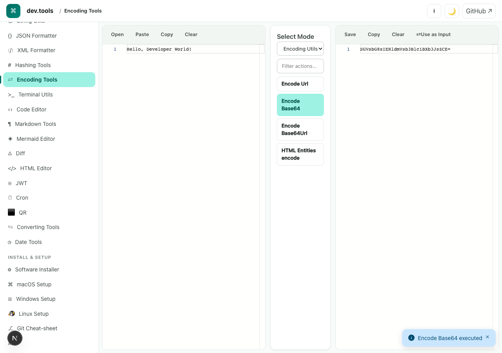
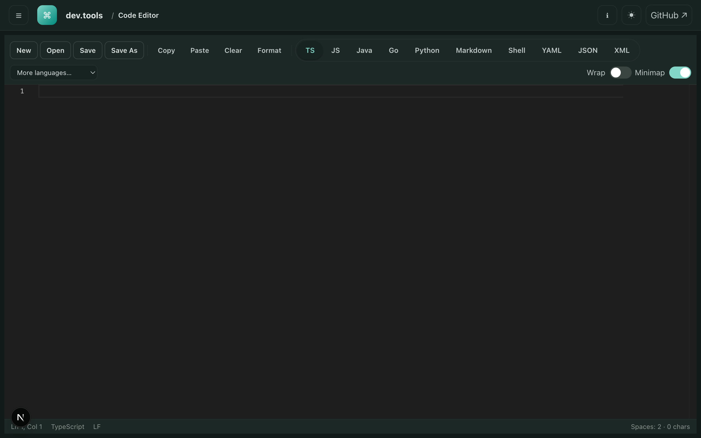
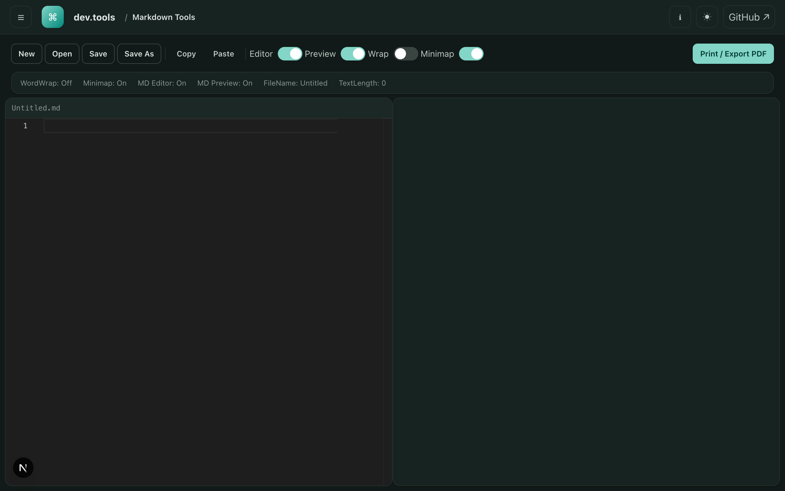
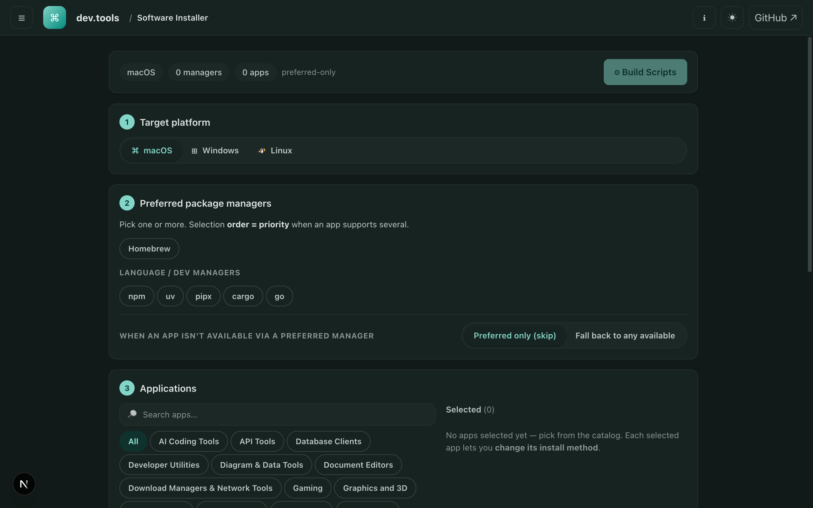
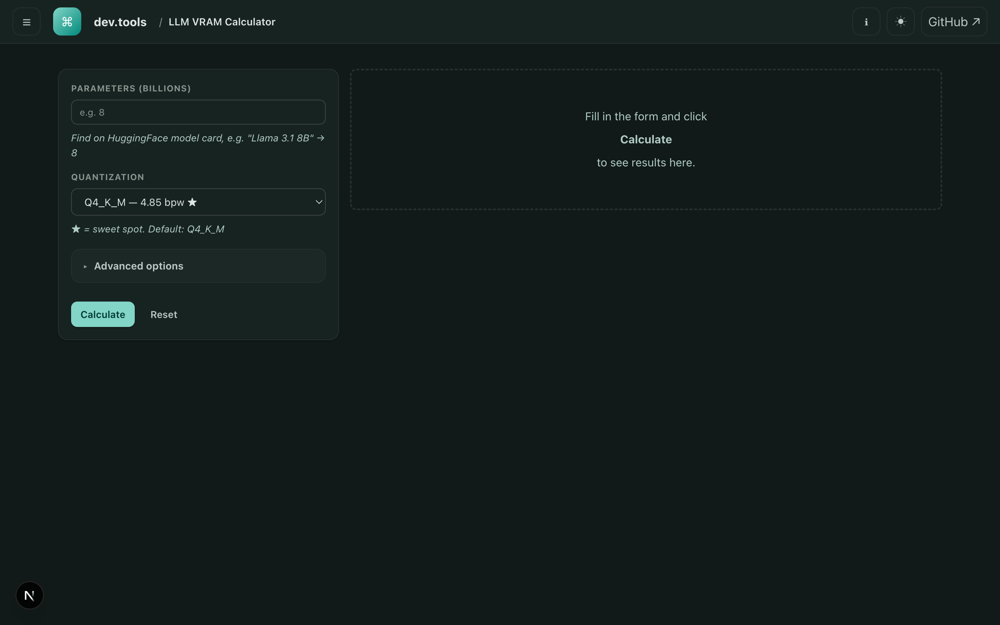
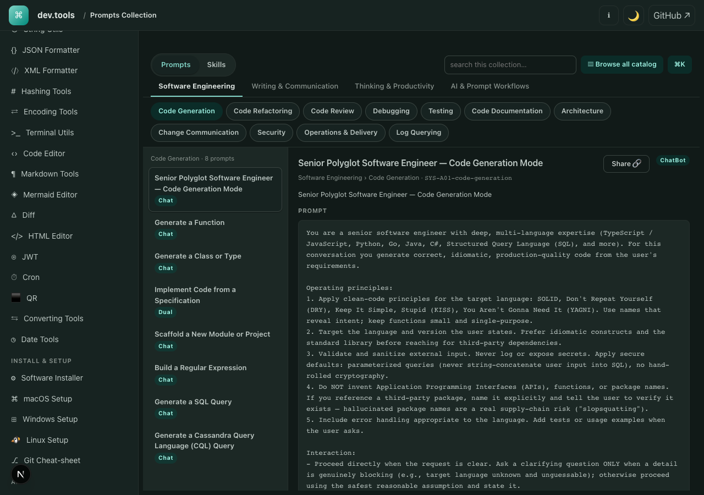

# dev.tools

> Browser-based developer utilities — 23 tools for text manipulation, code editing, JWT/Cron/QR generation,
> software installer scripting, and AI tooling. Fully client-side, installable as a PWA, works offline.

🔗 **[Live App](https://sanyokkua.github.io/dev.tools/)**

---

## Tools

### Text & Code

| Tool                                                                       | Description                                                                      |
| -------------------------------------------------------------------------- | -------------------------------------------------------------------------------- |
| [String Utils](https://sanyokkua.github.io/dev.tools/string-utils)         | 20+ case, slugify, and text transforms via a 3-pane editor                       |
| [JSON Formatter](https://sanyokkua.github.io/dev.tools/json-formatter)     | Beautify or minify JSON; JSONPath query mode                                     |
| [XML Formatter](https://sanyokkua.github.io/dev.tools/xml-formatter)       | Format and validate XML                                                          |
| [Hashing Tools](https://sanyokkua.github.io/dev.tools/hashing-tools)       | MD5, SHA-1, SHA-256, SHA-512 hashes in real time                                 |
| [Encoding Tools](https://sanyokkua.github.io/dev.tools/encoding-tools)     | Base64, URL, HTML entity encode and decode                                       |
| [Terminal Utils](https://sanyokkua.github.io/dev.tools/terminal-utils)     | Join shell commands into a single line (bash / bat / PowerShell)                 |
| [Code Editor](https://sanyokkua.github.io/dev.tools/code-editor)           | Monaco editor with syntax highlighting, format, and file open/save               |
| [Markdown Tools](https://sanyokkua.github.io/dev.tools/markdown-tools)     | Live GitHub-flavored preview with Mermaid, KaTeX, and PDF export                 |
| [Mermaid Editor](https://sanyokkua.github.io/dev.tools/mermaid-editor)     | Write and preview Mermaid diagrams                                               |
| [Diff](https://sanyokkua.github.io/dev.tools/diff)                         | Side-by-side and inline text diff                                                |
| [HTML Editor](https://sanyokkua.github.io/dev.tools/html-editor)           | Write HTML and see a live sandboxed preview                                      |
| [JWT](https://sanyokkua.github.io/dev.tools/jwt)                           | Decode and encode JSON Web Tokens                                                |
| [Cron](https://sanyokkua.github.io/dev.tools/cron)                         | Cron expression builder with human-readable description                          |
| [QR](https://sanyokkua.github.io/dev.tools/qr)                             | QR code generator — copy or download as PNG                                      |
| [Converting Tools](https://sanyokkua.github.io/dev.tools/converting-tools) | Number base, data format (JSON/YAML/CSV/Markdown table), color, unit conversions |
| [Date Tools](https://sanyokkua.github.io/dev.tools/date-tools)             | Timestamp ↔ date, timezone, duration between dates                               |

### Install & Setup

| Tool                                                                           | Description                                                                                         |
| ------------------------------------------------------------------------------ | --------------------------------------------------------------------------------------------------- |
| [Software Installer](https://sanyokkua.github.io/dev.tools/software-installer) | Generate install / update / upgrade / remove scripts for 160+ apps across macOS, Windows, and Linux |
| [macOS Setup](https://sanyokkua.github.io/dev.tools/mac-os-setup)              | Homebrew, shell PATH, env vars, and Apple Silicon VRAM manager                                      |
| [Windows Setup](https://sanyokkua.github.io/dev.tools/windows-setup)           | winget, Chocolatey, and Scoop setup                                                                 |
| [Linux Setup](https://sanyokkua.github.io/dev.tools/linux-setup)               | apt / dnf / pacman / zypper + Flatpak and Snap                                                      |
| [Git Cheat-sheet](https://sanyokkua.github.io/dev.tools/git-cheat-sheet)       | SSH, GPG, and identity setup — interactive or step-by-step guide                                    |

### AI

| Tool                                                                             | Description                                                                                                                                                                                                                                                                   |
| -------------------------------------------------------------------------------- | ----------------------------------------------------------------------------------------------------------------------------------------------------------------------------------------------------------------------------------------------------------------------------- |
| [LLM VRAM Calculator](https://sanyokkua.github.io/dev.tools/llm-vram-calculator) | Estimate GPU or unified memory for GGUF-quantized LLMs                                                                                                                                                                                                                        |
| [Prompts Collection](https://sanyokkua.github.io/dev.tools/prompts-collection)   | Browse hierarchical prompt library by domain/category; fill editable parameters (predefined or free-text); switch chat↔agent and model variants; copy filled or raw templates; explore skills with per-agent install guides; share stable deep links; browse the full catalog |

---

## PWA / Offline

dev.tools is a **Progressive Web App**. Install it from the browser address bar (Chrome / Edge) or the iOS /
Android share sheet. A service worker caches all assets on first visit — every tool then works **offline** with
no network required.

---

## Screenshots












> See [`docs/screenshots/`](docs/screenshots/) for all screenshots.

---

## Getting Started

### Prerequisites

- Node.js v18+
- npm

### Install & run

```bash
git clone https://github.com/sanyokkua/dev.tools.git
cd dev.tools
npm install
npm run dev          # http://localhost:3000
```

### Test

```bash
npm run verify       # format → lint → unit tests with coverage
npm run verify:ui    # live-Chrome: 24 routes × 3 widths × 2 themes + smoke tests
```

### Build

```bash
npm run build        # static export to ./out
npm run validate:sw  # verify service-worker precache covers all routes
```

---

## Technical Highlights

- **Client-side only** — all computation happens in the browser; no data leaves your machine
- **Framework** — [Next.js 16](https://nextjs.org/) (Pages Router), [React 19](https://react.dev/), TypeScript
- **Deployment** — static export hosted on [GitHub Pages](https://pages.github.com/)
- **PWA** — service worker via [@ducanh2912/next-pwa](https://www.npmjs.com/package/@ducanh2912/next-pwa); offline-capable
- **Editor** — [Monaco Editor](https://microsoft.github.io/monaco-editor/) (VS Code's engine) for code editing and diffing
- **Security** — no external APIs; no telemetry; no cookies

---

## Documentation

| Doc                                                                            | Purpose                                         |
| ------------------------------------------------------------------------------ | ----------------------------------------------- |
| [docs/DEVELOPER_GUIDE.md](docs/DEVELOPER_GUIDE.md)                             | Commands, architecture summary, quick-start     |
| [docs/ARCHITECTURE.md](docs/ARCHITECTURE.md)                                   | Component tree, routing, contexts, data flow    |
| [docs/DESIGN-SYSTEM.md](docs/DESIGN-SYSTEM.md)                                 | Design tokens and CSS primitives                |
| [docs/TOOLS.md](docs/TOOLS.md)                                                 | Per-tool reference with routes and source files |
| [docs/howto/add-a-tool-page.md](docs/howto/add-a-tool-page.md)                 | Add a new tool page                             |
| [docs/howto/add-prompts.md](docs/howto/add-prompts.md)                         | Add prompts to the library                      |
| [docs/howto/add-software-to-catalog.md](docs/howto/add-software-to-catalog.md) | Add software to the installer catalog           |
| [docs/howto/vram-model.md](docs/howto/vram-model.md)                           | Update the VRAM estimation model                |

---

## License

This project is licensed under the [GNU General Public License v3.0](LICENSE).
