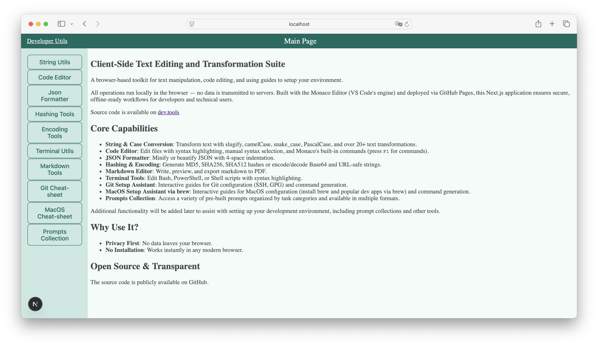

# Client-Side Text Transformation & Code Editing Toolkit

A **fully client-side application** for text manipulation, code editing, and cheat-sheets for configuring environment.
Built with the [Monaco Editor](https://microsoft.github.io/monaco-editor/) (VS Code’s engine) and deployed via GitHub
Pages, this Next.js app performs all operations directly in the browser — no data is sent to external servers.
Ideal for developers, technical writers, and data engineers requiring secure, offline-capable tools without opening any
editors on your local PC (or to use on the Cloud VMs).

🔗 **[Live App](https://sanyokkua.github.io/dev.tools/)**

---

## Core Features

### **Text Manipulation**

- **String Conversion**: Slugify (dash/underscore), camelCase, snake_case, PascalCase, kebab-case, and 15+ variants.
- **Case Control**: Lower/upper/title/sentence case, and swap-case inversion.
- **Line Operations**: Split, sort, deduplicate, and shuffle lines using custom delimiters (commas, pipes, etc.).

### **Code & Data Tools**

- **Monaco Code Editor**:
    - Syntax highlighting for all major languages.
    - Manual syntax selection and Monaco commands via `F1`.
- **JSON Formatter**: Minify or format JSON with 4-space indentation.
- **Hashing & Encoding**:
    - Generate MD5, SHA1, SHA256, SHA384, SHA512 hashes.
    - Encode/decode Base64 and URL-safe strings.

### **Specialized Editors**

- **Markdown Editor**: Live preview, syntax highlighting, PDF export via browser print.
- **Terminal Script Editor**: Syntax support for Bash, PowerShell, Shell, and Batch scripts.

### **Git Configuration Assistant**

- **Interactive Guides**: Step-by-step SSH, GPG, and email setup for Git.
- **Command Generator**: Auto-generate Git commands based on user input.

---

## Screenshots of some app pages




---

## Dependencies

### **Runtime Dependencies**

| Package                                                                    | Functionality                                                                |
| -------------------------------------------------------------------------- | ---------------------------------------------------------------------------- |
| [@monaco-editor/react](https://www.npmjs.com/package/@monaco-editor/react) | Monaco Editor integration for code editing                                   |
| [copy-to-clipboard](https://www.npmjs.com/package/copy-to-clipboard)       | Clipboard copy functionality                                                 |
| [highlight.js](https://highlightjs.org/)                                   | Syntax highlighting in Markdown and code editors                             |
| [react-markdown](https://www.npmjs.com/package/react-markdown)             | Markdown parsing with [remark-gfm](https://www.npmjs.com/package/remark-gfm) |
| [remark-gfm](https://www.npmjs.com/package/remark-gfm)                     | GitHub Flavored Markdown extensions (tables, tasklists, autolinks)           |
| [remark-math](https://www.npmjs.com/package/remark-math)                   | Math notation support in Markdown                                            |
| [rehype](https://www.npmjs.com/package/rehype)                             | HTML processing framework for markdown-to-html transformations               |
| [rehype-highlight](https://www.npmjs.com/package/rehype-highlight)         | Syntax highlighting for code blocks using Highlight.js                       |
| [rehype-katex](https://www.npmjs.com/package/rehype-katex)                 | Renders LaTeX math equations using KaTeX                                     |
| [react-to-print](https://www.npmjs.com/package/react-to-print)             | PDF export from Markdown editor                                              |
| [uuid](https://www.npmjs.com/package/uuid)                                 | Unique identifier generation                                                 |
| [coreutilsts](https://www.npmjs.com/package/coreutilsts)                   | Wrapper for popular utility libraries                                        |
| [sass](https://sass-lang.com/)                                             | CSS preprocessor with variables, mixins, and nested CSS support              |

---

## Technical Highlights

- **Client-Side Only**: All computations occur in the browser. No data is stored or transmitted.
- **Framework**: Built with [Next.js](https://nextjs.org/) (v15)
- **Deployment**: Static export hosted on [GitHub Pages](https://pages.github.com/).
- **Security**: No external APIs or server dependencies.

---

## Getting Started

### **Prerequisites**

- Node.js (v18+)
- npm or yarn

### **Installation**

```bash
git clone https://github.com/sanyokkua/dev.tools.git
cd dev.tools
npm install
```

### **Running Locally**

```bash
npm run dev
```

Visit `http://localhost:3000` in your browser.

### **Building for Production**

```bash
npm run build
```

---

## License

This project is licensed under the [GNU General Public License v3.0](LICENSE).  
For more details, see the [LICENSE file](LICENSE).

---
