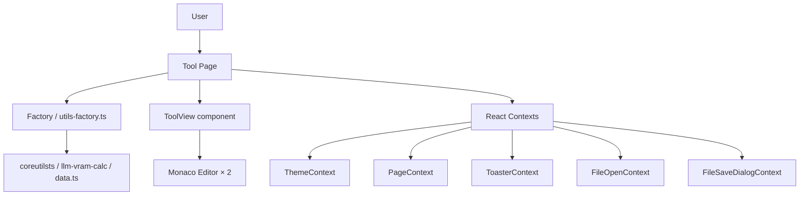
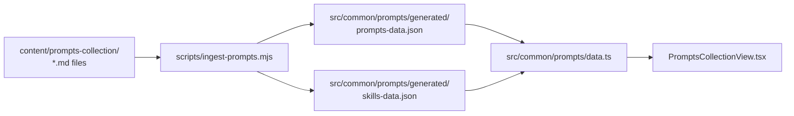
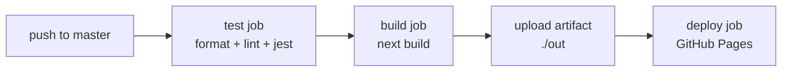

# dev.tools Architecture (v3.0.0)

Static Next.js export deployed to GitHub Pages. Browser-based developer utilities suite.

---

## App Shell

### ApplicationLayout

`src/components/app-layout/ApplicationLayout.tsx` — root layout component rendered for every page. Composes:

- `ApplicationTopBar` — hamburger menu button, logo, theme toggle
- `ApplicationSidebar` — collapsible navigation; collapse state persisted in `localStorage`
- `AppMainContentContainer` — scrollable content area that wraps the active page

### ApplicationTopBar

`src/components/app-layout/ApplicationTopBar.tsx`

### ApplicationSidebar

`src/components/app-layout/ApplicationSidebar.tsx` — wraps the `Sidebar` element. 24 nav items across 3 groups.

---

## Sidebar Routes (24 total)

### Text & Code (17 items)

| Label            | Route               |
| ---------------- | ------------------- |
| Dashboard        | `/`                 |
| String Utils     | `/string-utils`     |
| JSON Formatter   | `/json-formatter`   |
| XML Formatter    | `/xml-formatter`    |
| Hashing Tools    | `/hashing-tools`    |
| Encoding Tools   | `/encoding-tools`   |
| Terminal Utils   | `/terminal-utils`   |
| Code Editor      | `/code-editor`      |
| Markdown Tools   | `/markdown-tools`   |
| Mermaid Editor   | `/mermaid-editor`   |
| Diff             | `/diff`             |
| HTML Editor      | `/html-editor`      |
| JWT              | `/jwt`              |
| Cron             | `/cron`             |
| QR               | `/qr`               |
| Converting Tools | `/converting-tools` |
| Date Tools       | `/date-tools`       |

### Install & Setup (5 items)

| Label              | Route                 |
| ------------------ | --------------------- |
| Software Installer | `/software-installer` |
| macOS Setup        | `/mac-os-setup`       |
| Windows Setup      | `/windows-setup`      |
| Linux Setup        | `/linux-setup`        |
| Git Cheat-sheet    | `/git-cheat-sheet`    |

### AI (2 items)

| Label               | Route                  |
| ------------------- | ---------------------- |
| LLM VRAM Calculator | `/llm-vram-calculator` |
| Prompts Collection  | `/prompts-collection`  |

> **Note:** `/converting-tools`, `/date-tools`, and `/windows-setup` have routes but are hidden/disabled in the sidebar.

---

## Context Providers

All providers live in `src/components/contexts/`. They are composed in `src/pages/_app.tsx`.

| Provider                 | Hook                  | Responsibility                                                              |
| ------------------------ | --------------------- | --------------------------------------------------------------------------- |
| `ThemeProvider`          | `useTheme()`          | light/dark theme; persists to `localStorage`; sets `data-theme` on `<html>` |
| `PageProvider`           | `usePage()`           | `pageTitle`, `helpVisible`, `hasToolAbout`                                  |
| `ToasterProvider`        | `useToast()`          | `showToast()` for transient toast notifications                             |
| `FileOpenProvider`       | `useFileOpen()`       | `showFileOpenDialog()` for native file picker                               |
| `FileSaveDialogProvider` | `useFileSaveDialog()` | `showFileSaveDialog()`, `saveAs()`, `save()`, `currentHandle`               |

### Provider Wrapping Order (`_app.tsx`, outer → inner)

```
ThemeProvider
  PageProvider
    ToasterProvider
      FileOpenProvider
        FileSaveDialogProvider
          ApplicationLayout
            Component (active page)
```

---

## Page Architecture Patterns

Three patterns are used across the 24 routes.

### Pattern 1 — ToolView (most common)

Used by: `string-utils`, `json-formatter`, `hashing-tools`, `encoding-tools`, and similar.

- Page builds a `ToolViewFunctionGroups` (`Map`) with `useMemo`
- Renders `<ToolView searchable toolViewFunctionGroups={groupsMap} />`
- Tool logic lives in factory functions in `src/common/utils-factory.ts`
- Each entry in the map has: `toolId`, `textToDisplay`, `toolFunction`

Reference implementation: `src/pages/string-utils/index.tsx`

### Pattern 2 — Editor

Used by: `code-editor`, `markdown-tools`, `mermaid-editor`.

- Full-screen split pane: Monaco editor on the left, preview/output on the right
- Uses `.editorpane` / `.eh` / `.eb` CSS primitives
- Monaco is wrapped via `src/components/controls/TextEditor`

Reference implementation: `src/pages/code-editor/index.tsx`

### Pattern 3 — Custom

Used by: `software-installer`, `llm-vram-calculator`, `jwt`, `cron`, `qr`, and others.

- Bespoke layout tailored to the tool's UX requirements
- May use React Context API, complex local state, or heavy third-party libraries
- No shared structural pattern; each tool owns its layout

Reference implementation: `src/pages/software-installer/index.tsx`

---

## Data Flow



---

## Prompts Data Pipeline

The Prompts Collection uses a file-based pipeline separate from the React component tree. Prompt Markdown files are the source of truth; the ingester produces runtime JSON.



Run `npm run ingest:prompts` after adding or editing any file under `content/prompts-collection/`.

**Content directory layout:**

```
content/prompts-collection/
  <DOMAIN>/
    SYSTEM_PROMPTS/   ← SYS-* prompt files
    USER_PROMPTS/     ← USR-* and AGT-* prompt files
    SKILLS/<slug>/SKILL.md
```

Domains: `A_SOFTWARE_ENGINEERING/`, `B_WRITING_COMMUNICATION/`, `C_THINKING_PRODUCTIVITY/`, `D_AI_PROMPT_WORKFLOWS/`.

### Deep-Link Routing

`/prompts-collection` encodes all UI state in query parameters, enabling bookmarkable and shareable URLs:

| Parameter          | Purpose                 | Example                        |
| ------------------ | ----------------------- | ------------------------------ |
| `?domain=<slug>`   | Active domain tab       | `?domain=software-engineering` |
| `?category=<slug>` | Active category         | `?category=code-generation`    |
| `?prompt=<LP-id>`  | Open logical prompt     | `?prompt=LP-A01-implement`     |
| `?view=catalog`    | Browse-all catalog view | `?view=catalog`                |
| `?type=skills`     | Skills library view     | `?type=skills`                 |

Unknown slugs fall back gracefully to the first available domain/category. The service worker caches each visited URL so deep links work offline after the first visit.

---

## Static Export & GitHub Pages

`next.config.mjs` configures a full static export:

```js
const nextConfig = {
    reactStrictMode: true,
    output: 'export',
    assetPrefix: assetPrefix,
    basePath: basePath,
    env: { NEXT_PUBLIC_BASE_PATH: basePath },
};
```

`assetPrefix` and `basePath` are derived from the `GITHUB_REPOSITORY` env var (owner prefix stripped) when `GITHUB_ACTIONS` is set. In local development both values are empty strings.

---

## PWA

Powered by `@ducanh2912/next-pwa` + Workbox. Configured in `next.config.mjs`:

| Setting                         | Value                                                      |
| ------------------------------- | ---------------------------------------------------------- |
| `dest`                          | `'public'` — outputs `public/sw.js`                        |
| `disable`                       | `process.env.NODE_ENV === 'development'` (production only) |
| `register`                      | `true`                                                     |
| `skipWaiting`                   | `true`                                                     |
| `cacheOnFrontEndNav`            | `true`                                                     |
| `reloadOnOnline`                | `true`                                                     |
| `maximumFileSizeToCacheInBytes` | `8388608` (8 MB)                                           |
| Excluded file                   | `dynamic-css-manifest.json`                                |

Run `npm run validate:sw` after every build to verify the service worker precache covers all routes.

---

## CI/CD Pipeline

Defined in `.github/workflows/nextjs.yml`. Three sequential jobs:



### Job Details

**test**

- Checkout, Node 22, `npm ci`
- `check:format`, `lint`, `test`

**build** (needs: test)

- Checkout, setup Pages action (auto-injects `basePath`)
- `npm ci`, `next build`
- Uploads `./out` as the Pages artifact

**deploy** (needs: build)

- `actions/deploy-pages` — publishes the artifact to GitHub Pages

---

## Directory Structure

```
content/
  prompts-collection/       # Prompt Markdown source files (source of truth for Prompts Collection)
    <DOMAIN>/
      SYSTEM_PROMPTS/       # SYS-* prompt files
      USER_PROMPTS/         # USR-* and AGT-* prompt files
      SKILLS/<slug>/        # Skill folders (SKILL.md + optional assets)
    INDEX.md                # Inventory and naming conventions reference
src/
  pages/                    # Next.js routes, one folder per tool
  components/
    app-layout/             # ApplicationLayout, ApplicationTopBar, ApplicationSidebar
    contexts/               # ThemeProvider, PageProvider, ToasterProvider, FileOpenProvider, FileSaveDialogProvider
    controls/               # Button, Input, Select, Modal, EditableCombobox, SegmentedControl, TextEditor (Monaco wrapper)
    layouts/                # Flex/grid layout primitives
    elements/column/        # ToolView generic component
    page-specific/          # VRAM calculator, prompts, git cheat sheet
  common/
    prompts/
      generated/            # prompts-data.json, skills-data.json (written by ingest-prompts.mjs)
      data.ts               # React data accessors over generated JSON
    ...                     # Other pure utility functions, type definitions, utils-factory.ts
  styles/                   # SCSS files; colors.scss for design tokens
```

### Path Aliases (tsconfig)

| Alias          | Resolves to                 |
| -------------- | --------------------------- |
| `@/*`          | `src/*`                     |
| `@/contexts/*` | `src/components/contexts/*` |
| `@/controls/*` | `src/components/controls/*` |
| `@/elements/*` | `src/components/elements/*` |
| `@/styles/*`   | `src/styles/*`              |

---

## Testing

- Tests live in `test/`
- Configuration: `jest.config.ts` (jsdom environment)
- File pattern: `**/test/**/*.test.ts(x)`
- Setup file: `test/setup.ts`

Run a single test file:

```bash
npx jest test/path/to/file.test.ts
```
