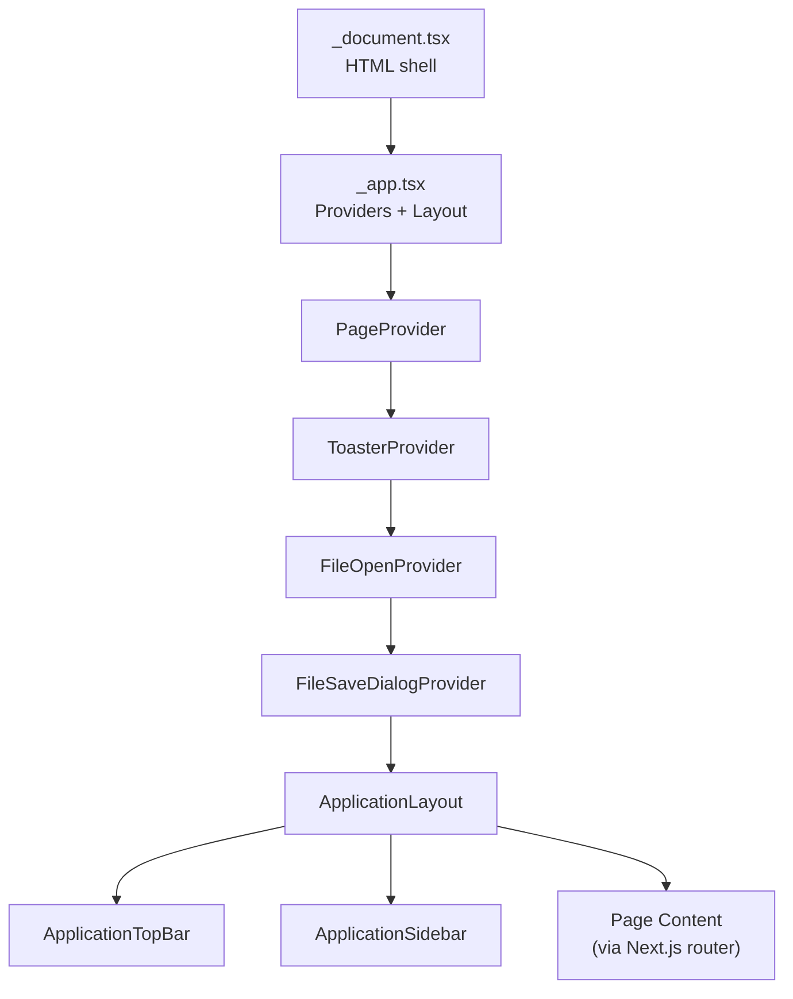

# Developer Guide — dev.tools

> **Version:** 1.2.2 | **Framework:** Next.js 15 (Pages Router) | **Language:** TypeScript + React 19
> **Deployment:** Static export → GitHub Pages | **Live:** [sanyokkua.github.io/dev.tools](https://sanyokkua.github.io/dev.tools/)

---

## Table of Contents

1. [Project Overview](#1-project-overview)
2. [Technology Stack](#2-technology-stack)
3. [Project Structure](#3-project-structure)
4. [Architecture Overview](#4-architecture-overview)
5. [Build, Run & Test](#5-build-run--test)
6. [CI/CD Pipeline](#6-cicd-pipeline)
7. [Styling System](#7-styling-system)
8. [Context Providers](#8-context-providers)
9. [Common Utilities (`src/common/`)](#9-common-utilities-srccommon)
10. [Component Library (`src/components/`)](#10-component-library-srccomponents)
11. [Page Architecture Patterns](#11-page-architecture-patterns)
12. [How to Add a New Page](#12-how-to-add-a-new-page)
13. [How to Add New String/Hashing/Encoding Utilities](#13-how-to-add-new-stringhashingencoding-utilities)
14. [How to Add New Prompts](#14-how-to-add-new-prompts)
15. [Testing Guide](#15-testing-guide)

---

## 1. Project Overview

**dev.tools** is a fully client-side, browser-based developer toolkit for text manipulation, code editing, and environment setup guides. All operations execute in the browser — no data is sent to external servers.

### Core Features

| Feature Area           | What It Does                                                                 |
| ---------------------- | ---------------------------------------------------------------------------- |
| **String Utils**       | 20+ transformations — slugify, camelCase, snake_case, split/sort/dedup lines |
| **Code Editor**        | Full Monaco Editor with syntax highlighting, file open/save, language picker |
| **JSON Formatter**     | Minify or beautify JSON with 4-space indentation                             |
| **Hashing Tools**      | MD5, SHA-1, SHA-256, SHA-384, SHA-512 hash generation                        |
| **Encoding Tools**     | Base64 and URL-safe encode/decode                                            |
| **Terminal Utils**     | Shell/Bash/PowerShell script editor with command joining                     |
| **Markdown Tools**     | Split-pane Monaco editor + live ReactMarkdown preview, PDF export            |
| **Git Cheat Sheet**    | Interactive + manual guides for Git SSH/GPG setup, command generation        |
| **MacOS Cheat Sheet**  | Homebrew install guide with app transfer/selection and `brew` command gen    |
| **Prompts Collection** | Filterable prompt library with parameterized templates for LLMs              |

---

## 2. Technology Stack

### Runtime Dependencies

| Package                     | Purpose                                           |
| --------------------------- | ------------------------------------------------- |
| `next` (v15)                | React framework with Pages Router, static export  |
| `react` / `react-dom` (v19) | UI library                                        |
| `@monaco-editor/react`      | VS Code's editor engine for code editing pages    |
| `coreutilsts`               | String, case, hashing, encoding utility functions |
| `react-markdown`            | Markdown rendering with plugins                   |
| `remark-gfm`                | GitHub Flavored Markdown (tables, tasklists)      |
| `remark-math`               | LaTeX math notation in Markdown                   |
| `rehype-highlight`          | Syntax highlighting in code blocks                |
| `rehype-katex`              | KaTeX math equation rendering                     |
| `react-to-print`            | PDF export from Markdown preview                  |
| `highlight.js`              | Syntax highlighting engine                        |
| `copy-to-clipboard`         | Clipboard copy utility                            |
| `uuid`                      | Unique ID generation (toaster notifications)      |
| `sass`                      | SCSS preprocessing                                |

### Dev Dependencies

| Tool                              | Purpose                         |
| --------------------------------- | ------------------------------- |
| `typescript` (v5)                 | Type checking                   |
| `jest` + `@testing-library/react` | Unit/component testing (jsdom)  |
| `eslint` + `eslint-config-next`   | Linting                         |
| `prettier`                        | Code formatting                 |
| `husky`                           | Git hooks for pre-commit checks |

---

## 3. Project Structure

```
dev.tools/
├── .github/workflows/nextjs.yml   # CI/CD: build + deploy to GitHub Pages
├── public/                        # Static assets (favicons, manifest)
├── src/
│   ├── common/                    # Shared business logic & utilities
│   │   ├── constants.ts           # Default language, extension, MIME type
│   │   ├── types.ts               # Core interfaces (IStringUtil, IHashUtil, etc.)
│   │   ├── file-types.ts          # FileInfo, FileSaveProperties types
│   │   ├── file-utils.ts          # File open/save/create helpers
│   │   ├── clipboard-utils.ts     # Clipboard interaction
│   │   ├── formatting-tools.ts    # JSON formatting, boolean mapping
│   │   ├── utils-factory.ts       # ★ Factory functions for all tool utilities
│   │   ├── git-utils.ts           # Git/SSH/GPG command constants & generators
│   │   ├── macos-utils.ts         # Homebrew app catalog & command builders
│   │   ├── llm-vram-calc.ts       # LLM VRAM calculator logic
│   │   └── prompts/               # Prompt system
│   │       ├── prompts.ts         # Prompt types, filters, param extraction
│   │       ├── prompts-library.ts # Aggregates all prompt collections
│   │       ├── system-prompts.ts  # System prompt definitions
│   │       ├── user-prompts.ts    # User parametrized prompts
│   │       └── dev-chat-user-prompts.ts  # Conversation-focused prompts
│   │
│   ├── components/
│   │   ├── app-layout/            # Top-level app shell
│   │   │   ├── ApplicationLayout.tsx   # Main layout: TopBar + Sidebar + Content
│   │   │   ├── ApplicationSidebar.tsx  # ★ Sidebar with route definitions
│   │   │   └── ApplicationTopBar.tsx   # Top bar with app title + page title
│   │   │
│   │   ├── contexts/              # React Context providers
│   │   │   ├── PageContext.tsx     # Page title state
│   │   │   ├── ToasterContext.tsx  # Toast notification system
│   │   │   ├── FileOpenContext.tsx # File open dialog (hidden input)
│   │   │   └── FileSaveDialogContext.tsx  # File save dialog
│   │   │
│   │   ├── controls/              # Primitive UI components
│   │   │   ├── Button.tsx         # Configurable button (variant, size, color)
│   │   │   ├── Input.tsx          # Text input
│   │   │   ├── Select.tsx         # Dropdown select
│   │   │   ├── Modal.tsx          # Modal dialog (portal-based)
│   │   │   ├── Chip.tsx           # Tag/chip element
│   │   │   ├── TextEditor.tsx     # Textarea component
│   │   │   ├── InformationPanel.tsx   # Status bar with info items
│   │   │   ├── SaveFileDialog.tsx # Save-file modal with name/extension
│   │   │   ├── toaster/           # Toast notification rendering
│   │   │   └── types.ts           # Shared control types (Color)
│   │   │
│   │   ├── elements/              # Complex composed components
│   │   │   ├── CodeSnippet.tsx    # Read-only code block with copy button
│   │   │   ├── column/            # ★ ToolView — two-panel transform UI
│   │   │   │   ├── ToolView.tsx   # Input/output editors + function picker
│   │   │   │   └── ColumnMenu.tsx # Tool function selection panel
│   │   │   ├── editor/            # Monaco Editor wrapper
│   │   │   │   ├── CodeEditor.tsx # Main editor component
│   │   │   │   ├── CodeEditorMenu.tsx  # Editor-specific menubar
│   │   │   │   ├── CodeEditorInfoLine.tsx  # Status line
│   │   │   │   ├── FileNameElement.tsx
│   │   │   │   ├── code-editor-utils.ts  # Editor helper functions
│   │   │   │   └── types.ts
│   │   │   ├── navigation/        # Navigation elements
│   │   │   │   ├── appbar/Appbar.tsx
│   │   │   │   ├── sidebar/Sidebar.tsx
│   │   │   │   └── menubar/       # Action menubar with builder pattern
│   │   │   │       ├── Menubar.tsx
│   │   │   │       ├── types.ts
│   │   │   │       └── utils.ts   # MenuBuilder class
│   │   │   ├── prompt/            # Prompt collection UI
│   │   │   │   ├── PromptTable.tsx
│   │   │   │   ├── PromptView.tsx
│   │   │   │   ├── PromptFilters.tsx
│   │   │   │   ├── LabeledTextEditor.tsx
│   │   │   │   ├── usePromptsFilter.ts
│   │   │   │   └── helpers.ts
│   │   │   └── transfer/          # Transfer list (macOS app selector)
│   │   │       ├── AppTransferComponent.tsx
│   │   │       ├── TransferColumns.tsx
│   │   │       ├── TransferColumn.tsx
│   │   │       ├── TransferControls.tsx
│   │   │       ├── TransferTable.tsx
│   │   │       ├── useTransfer.ts
│   │   │       └── helpers.ts
│   │   │
│   │   ├── layouts/               # Container/layout components
│   │   │   ├── AppMainContainer.tsx
│   │   │   ├── AppMainContentContainer.tsx
│   │   │   ├── AppSideBarAndContentContainer.tsx
│   │   │   ├── ContentContainerFlex.tsx
│   │   │   ├── ContentContainerGrid.tsx
│   │   │   ├── ContentContainerGridChild.tsx
│   │   │   ├── HorizontalContainer.tsx
│   │   │   ├── PaperContainer.tsx
│   │   │   ├── RoundedContainer.tsx
│   │   │   ├── ScrollableContentContainer.tsx
│   │   │   └── TextContainer.tsx
│   │   │
│   │   └── page-specific/         # Components used by a single page
│   │       ├── git-cheat-sheet/
│   │       ├── mac-os-cheat-sheet/
│   │       └── prompts-collection/
│   │
│   ├── pages/                     # ★ Next.js Pages Router
│   │   ├── _app.tsx               # App wrapper (providers + layout)
│   │   ├── _document.tsx          # HTML document structure
│   │   ├── index.tsx              # Home page
│   │   ├── string-utils/index.tsx
│   │   ├── code-editor/index.tsx
│   │   ├── json-formatter/index.tsx
│   │   ├── hashing-tools/index.tsx
│   │   ├── encoding-tools/index.tsx
│   │   ├── terminal-utils/index.tsx
│   │   ├── markdown-tools/index.tsx
│   │   ├── git-cheat-sheet/index.tsx
│   │   ├── mac-os-cheat-sheet/index.tsx
│   │   ├── prompts-collection/index.tsx
│   │   ├── prompts-collection/[id].tsx  # Dynamic prompt detail page
│   │   ├── converting-tools/      # (Planned, commented out in sidebar)
│   │   ├── date-tools/            # (Planned, commented out in sidebar)
│   │   └── windows-cheat-sheet/   # (Planned, commented out in sidebar)
│   │
│   └── styles/                    # Global SCSS stylesheets
│       ├── global.css             # CSS reset
│       ├── colors.scss            # Color tokens & themes
│       ├── layout.scss            # Layout classes
│       ├── buttons.scss           # Button variants
│       ├── menubar.scss           # Menubar styles
│       ├── sidebar.scss           # Sidebar styles
│       ├── appbar.scss            # Top bar styles
│       ├── modal.scss             # Modal styles
│       ├── input.scss, select.scss, chip.scss, etc.
│       └── toaster.scss           # Toast notification styles
│
├── test/
│   ├── setup.ts                   # Jest setup (testing-library matchers)
│   └── common/
│       ├── prompts.test.ts        # Prompt filter/extraction tests
│       └── llm-vram-calc.test.ts  # VRAM calculator tests
│
├── package.json                   # Scripts, dependencies, prettier config
├── tsconfig.json                  # TypeScript config with path aliases
├── jest.config.ts                 # Jest config (jsdom, v8 coverage)
├── next.config.mjs                # Static export + GitHub Pages base path
└── eslint.config.mjs              # ESLint configuration
```

---

## 4. Architecture Overview

### Application Lifecycle



**Key architectural principles:**

1. **Static Site Generation (SSG):** The app uses `output: 'export'` in `next.config.mjs` to produce a fully static build. No server-side rendering or API routes.

2. **Pages Router:** Uses Next.js Pages Router (not App Router). Each page is a directory under `src/pages/` with an `index.tsx`.

3. **Context-Driven State:** Four React Context providers wrap the entire app, offering global services to all pages:
    - `PageContext` → dynamic page title
    - `ToasterContext` → toast notifications
    - `FileOpenContext` → native file-open dialog
    - `FileSaveDialogContext` → file-save modal

4. **Component Hierarchy:**
    - **Controls** → Primitive UI atoms (Button, Input, Select, Modal)
    - **Elements** → Composed molecules (CodeEditor, Menubar, ToolView, Transfer, Prompt)
    - **Layouts** → Container components for structural arrangement
    - **Page-specific** → Components used by only one page

5. **Factory Pattern for Utilities:** All string, case, line, hashing, encoding, and JSON formatter tools are created via factory functions in `utils-factory.ts`. Pages consume these through the generic `ToolView` component.

6. **Path Aliases:** TypeScript path aliases are configured in `tsconfig.json`:

    | Alias               | Maps To                          |
    | ------------------- | -------------------------------- |
    | `@/*`               | `./src/*`                        |
    | `@/common/*`        | `src/common/*`                   |
    | `@/contexts/*`      | `src/components/contexts/*`      |
    | `@/controls/*`      | `src/components/controls/*`      |
    | `@/layouts/*`       | `src/components/layouts/*`       |
    | `@/elements/*`      | `src/components/elements/*`      |
    | `@/page-specific/*` | `src/components/page-specific/*` |
    | `@/styles/*`        | `src/styles/*`                   |

---

## 5. Build, Run & Test

### Prerequisites

- **Node.js** v18+ (CI uses v22)
- **npm** (package manager)

### Commands

```bash
# Install dependencies
npm install

# Development server (hot-reload)
npm run dev
# → http://localhost:3000

# Production build (static export to ./out)
npm run build

# Build + serve static output locally
npm run start

# Run tests with coverage
npm run test

# Lint (ESLint + Next.js lint)
npm run lint

# Format code (Prettier)
npm run format

# Check formatting
npm run check:format

# Full verification pipeline
npm run verify
# → clean → format → stage → check:format → lint → test → clean

# Clean build artifacts
npm run clean
```

---

## 6. CI/CD Pipeline

The project uses a GitHub Actions workflow (`.github/workflows/nextjs.yml`) that:

1. **Triggers** on pushes to the `master` branch or manual dispatch
2. **Builds** the Next.js app via `next build` (static export)
3. **Deploys** the `./out` directory to GitHub Pages

The `next.config.mjs` dynamically sets `basePath` and `assetPrefix` to `/<repo-name>/` when running in GitHub Actions, ensuring correct asset paths on GitHub Pages.

---

## 7. Styling System

The project uses **SCSS** with a modular stylesheet approach. All styles are imported globally in `_app.tsx`:

| File            | Purpose                             |
| --------------- | ----------------------------------- |
| `colors.scss`   | Color tokens, CSS variables, themes |
| `layout.scss`   | Flexbox/grid layout classes         |
| `buttons.scss`  | All button variants and states      |
| `menubar.scss`  | Menubar navigation styles           |
| `sidebar.scss`  | Sidebar panel styles                |
| `appbar.scss`   | Top application bar                 |
| `modal.scss`    | Modal dialogs                       |
| `input.scss`    | Input field styles                  |
| `select.scss`   | Select dropdown styles              |
| `surfaces.scss` | Surface/card container styles       |
| `toaster.scss`  | Toast notification styles           |

Components use CSS class names (not CSS Modules) that correspond to these global stylesheets. The `Button` component, for example, composes classes like `button-base button-solid color-primary-color`.

---

## 8. Context Providers

All four context providers are declared in `_app.tsx` and wrap every page:

### PageContext

**File:** `src/components/contexts/PageContext.tsx`
**Hook:** `usePage()`
**Purpose:** Manages the current page title displayed in the top bar.

```tsx
const { pageTitle, setPageTitle } = usePage();

useEffect(() => {
    setPageTitle('My Page Title');
}, [setPageTitle]);
```

Every page **must** call `setPageTitle` in a `useEffect` to update the application top bar.

### ToasterContext

**File:** `src/components/contexts/ToasterContext.tsx`
**Hook:** `useToast()`
**Purpose:** Shows temporary toast notifications (info, success, warning, error).

```tsx
const { showToast } = useToast();

showToast({
    message: 'Operation completed',
    type: ToastType.SUCCESS,
    title: 'Success', // optional
    durationMs: 4000, // optional, default 4000
});
```

### FileOpenContext

**File:** `src/components/contexts/FileOpenContext.tsx`
**Hook:** `useFileOpen()`
**Purpose:** Triggers the native file-open dialog via a hidden `<input type="file">`.

```tsx
const { showFileOpenDialog } = useFileOpen();

showFileOpenDialog({
    supportedFiles: ['.txt', '.md', '.json'],
    onSuccess: (fileInfo?: FileInfo) => {
        /* handle file */
    },
    onFailure: (err?: unknown) => {
        /* handle error */
    },
});
```

### FileSaveDialogContext

**File:** `src/components/contexts/FileSaveDialogContext.tsx`
**Hook:** `useFileSaveDialog()`
**Purpose:** Opens a modal dialog for saving files with name and extension options.

```tsx
const { showFileSaveDialog } = useFileSaveDialog();

showFileSaveDialog({
    fileContent: 'Hello World',
    fileName: 'example',
    fileExtension: '.txt',
    mimeType: 'text/plain',
    availableExtensions: ['.txt', '.md'],
});
```

---

## 9. Common Utilities (`src/common/`)

### Core Types (`types.ts`)

| Type             | Purpose                                               |
| ---------------- | ----------------------------------------------------- |
| `IStringUtil`    | Sync string transformation tool (id, label, function) |
| `UtilList`       | Group of `IStringUtil` items with group metadata      |
| `IHashUtil`      | Async hash tool (returns `Promise<string>`)           |
| `OSType`         | `'windows' or 'macos' or 'linux'`                     |
| `Category`       | Software category enum (for macOS app catalog)        |
| `Application`    | App metadata (name, description, category, brewType)  |
| `Command`        | CLI command with description                          |
| `CommandBuilder` | Factory function `(app) => Command`                   |

### Utils Factory (`utils-factory.ts`)

This is the central factory module that creates all tool utilities. Each factory returns arrays of `IStringUtil` or `IHashUtil` objects:

| Factory Function                   | Returns         | Used By             |
| ---------------------------------- | --------------- | ------------------- |
| `createStringUtils()`              | `IStringUtil[]` | String Utils page   |
| `createCaseUtils()`                | `IStringUtil[]` | String Utils page   |
| `createLineUtils()`                | `IStringUtil[]` | String Utils page   |
| `createStringUtilList()`           | `UtilList[]`    | String Utils page   |
| `createHashingUtils()`             | `IHashUtil[]`   | Hashing Tools page  |
| `createEncodingDecodingUtilList()` | `UtilList[]`    | Encoding Tools page |
| `createJsonFormatter()`            | `IStringUtil[]` | JSON Formatter page |

All utilities delegate to the `coreutilsts` library for the actual transformations.

### File Utilities (`file-utils.ts`)

| Function                        | Purpose                                     |
| ------------------------------- | ------------------------------------------- |
| `saveTextFile(props)`           | Triggers browser file download              |
| `createFileReadPromise(file)`   | Returns a `Promise<string>` of file content |
| `createFileInfo(file, content)` | Builds a `FileInfo` from a `File` object    |
| `createDefaultFile()`           | Returns a blank "Untitled" `FileInfo`       |
| `createEmptyFile()`             | Returns a completely empty `FileInfo`       |

### Git Utils (`git-utils.ts`)

Contains constant strings for Git/SSH/GPG commands and a `generateGitCommands()` function that produces a full command sequence based on user input (name, email, OS, global/local config).

### MacOS Utils (`macos-utils.ts`)

Contains the Homebrew application catalog (`Application[]`) and command builder functions for generating `brew install` / `brew install --cask` commands.

### Prompts System (`common/prompts/`)

| File                       | Purpose                                                                                             |
| -------------------------- | --------------------------------------------------------------------------------------------------- |
| `prompts.ts`               | Types (`Prompt`, `PromptCategory`, `PromptType`), factory functions, filter logic, param extraction |
| `prompts-library.ts`       | Aggregates all prompts into `promptsLibraryList`                                                    |
| `system-prompts.ts`        | System prompt definitions                                                                           |
| `user-prompts.ts`          | User parametrized prompt definitions                                                                |
| `dev-chat-user-prompts.ts` | Conversation-focused prompt definitions                                                             |

**Prompt types:**

- `SYSTEM_PROMPT` — Core AI behavior instructions
- `USER_PROMPT_PARAMETRIZED` — Templates with `{{parameter}}` placeholders
- `USER_PROMPT_PARAMETRIZED_CONVERSATION_FOCUSED` — Multi-turn conversation prompts

---

## 10. Component Library (`src/components/`)

### Controls (Primitive UI Atoms)

| Component          | Key Props                                        |
| ------------------ | ------------------------------------------------ |
| `Button`           | `text`, `variant`, `size`, `colorStyle`, `block` |
| `Input`            | Standard text input with label                   |
| `Select`           | Dropdown with `SelectItem[]` items               |
| `Modal`            | Portal-rendered dialog with open/close callbacks |
| `Chip`             | Tag/label element                                |
| `TextEditor`       | Multi-line textarea                              |
| `InformationPanel` | Horizontal status bar displaying info items      |
| `SaveFileDialog`   | Modal for file save (name + extension)           |
| `Toaster`          | Toast notification renderer                      |

### Elements (Complex Composed Components)

#### ToolView (`elements/column/ToolView.tsx`)

The **most-reused** component. Provides a complete two-panel transformation interface:

```
┌──────────────────────────────────────────┐
│  Menubar (Open, Paste, Copy, Save, Clear)│
├──────────┬───────────┬───────────────────┤
│ Function │  Input    │  Output           │
│ Selector │  Editor   │  Editor           │
│ (left)   │ (Monaco)  │  (Monaco)         │
│          │           │                   │
└──────────┴───────────┴───────────────────┘
```

**Props:**

- `toolViewFunctionGroups: Map<string, ToolViewGroup>` — The available tool functions
- `toolChoseHeader?: string` — Header for the function selector panel
- `toolEditorsLangId?: string` — Monaco language ID for both editors (default: `plaintext`)

#### CodeEditor (`elements/editor/CodeEditor.tsx`)

A Monaco Editor wrapper with configurable:

- `languageId` — syntax highlighting language
- `wordWrap` / `minimap` — editor options
- `onEditorMounted` — callback receiving `EditorProperties` (editor instance + language maps)
- `onChange` — content change callback
- `height` — CSS height (default: `100vh`)

#### Menubar (`elements/navigation/menubar/`)

An action bar with buttons and dropdown submenus, built using a **Builder pattern**:

```tsx
const menuItems = MenuBuilder.newBuilder()
    .addButton('paste', 'Paste', handlePaste)
    .addButton('copy', 'Copy', handleCopy)
    .addSubmenu('language', 'Language', languageItems)
    .build();

<Menubar menuItems={menuItems} />;
```

#### Sidebar (`elements/navigation/sidebar/Sidebar.tsx`)

Renders a vertical list of `Button` components from a `SideBarItem[]` array. The `ApplicationSidebar` defines all routes and uses `next/router` for navigation.

#### CodeSnippet (`elements/CodeSnippet.tsx`)

A read-only code block with a **copy-to-clipboard** button and syntax highlighting. Used extensively in the Git and MacOS cheat-sheet pages.

#### Transfer (`elements/transfer/`)

A dual-list transfer component with category filtering, search, and command generation. Used by the MacOS cheat-sheet for Homebrew app selection. Key files:

- `useTransfer.ts` — Custom hook managing available/selected state
- `AppTransferComponent.tsx` — Main component wiring everything together
- `TransferColumns.tsx` / `TransferControls.tsx` — Sub-components

#### Prompt UI (`elements/prompt/`)

Components for the prompts collection feature:

- `PromptTable.tsx` — Table listing all prompts with filters
- `PromptView.tsx` — Detail view with parameter editing and template preview
- `PromptFilters.tsx` — Category, type, and tag filter controls
- `usePromptsFilter.ts` — Custom hook for filter state management

### Layouts (Container Components)

All layout components are thin wrappers applying CSS classes:

| Component                       | Purpose                             |
| ------------------------------- | ----------------------------------- |
| `AppMainContainer`              | Root-level full-viewport container  |
| `AppMainContentContainer`       | Main content area with color style  |
| `AppSideBarAndContentContainer` | Horizontal split: sidebar + content |
| `ContentContainerFlex`          | Flex column container               |
| `ContentContainerGrid`          | CSS Grid container                  |
| `HorizontalContainer`           | Horizontal flex row (side-by-side)  |
| `PaperContainer`                | Elevated card/paper surface         |
| `RoundedContainer`              | Rounded-border container            |
| `ScrollableContentContainer`    | Overflow-scroll container           |
| `TextContainer`                 | Content area for text rendering     |

---

## 11. Page Architecture Patterns

All pages in the codebase follow one of **three patterns**:

### Pattern 1: ToolView-Based Pages

**Used by:** String Utils, Hashing Tools, Encoding Tools, JSON Formatter

This is the simplest pattern. The page creates tool functions via factory, wraps them in `ToolViewFunctionGroups`, and passes them to the `ToolView` component:

```tsx
const IndexPage = () => {
    const { setPageTitle } = usePage();
    useEffect(() => {
        setPageTitle('Page Title');
    }, [setPageTitle]);

    const toolsGroups = useMemo(() => {
        const groupsMap: ToolViewFunctionGroups = new Map();
        // Use a factory to create tools
        createSomeUtils().forEach((tool) => {
            const group: ToolViewGroup = {
                funcGroupId: tool.toolGroupId,
                funcGroupName: tool.displayName,
                functions: tool.utils.map((func) => ({
                    funcId: func.toolId,
                    funcName: func.textToDisplay,
                    func: (text, onSuccess, onFailure) => {
                        try {
                            onSuccess(func.toolFunction(text));
                        } catch (e) {
                            onFailure(e);
                        }
                    },
                })),
            };
            groupsMap.set(tool.toolGroupId, group);
        });
        return groupsMap;
    }, []);

    return <ToolView toolChoseHeader="Select Tool" toolViewFunctionGroups={toolsGroups} />;
};
```

### Pattern 2: Editor-Based Pages

**Used by:** Code Editor, Markdown Tools, Terminal Utils

These pages directly use the `CodeEditor` component with additional custom UI (menus, info bars, preview panels):

```tsx
const IndexPage = () => {
    const { setPageTitle } = usePage();
    useEffect(() => {
        setPageTitle('Editor Page');
    }, [setPageTitle]);

    const editorRef = useRef<editor.IStandaloneCodeEditor | null>(null);

    const menuItems = MenuBuilder.newBuilder()
        .addButton('paste', 'Paste', handlePaste)
        .addButton('copy', 'Copy', handleCopy)
        .build();

    return (
        <>
            <Menubar menuItems={menuItems} />
            <CodeEditor
                minimap={true}
                wordWrap={false}
                languageId="javascript"
                onEditorMounted={(props) => {
                    editorRef.current = props.editor;
                }}
                onChange={handleTextChange}
            />
        </>
    );
};
```

### Pattern 3: Guide/Custom Pages

**Used by:** Git Cheat Sheet, MacOS Cheat Sheet, Prompts Collection, Home

These pages have fully custom layouts combining various components:

- **Git Cheat Sheet:** Form input → command generation → `CodeSnippet` list
- **MacOS Cheat Sheet:** `AppTransferComponent` for app selection + brew commands
- **Prompts Collection:** `PromptTable` with filters + detail pages via dynamic routing (`[id].tsx`)

---

## 12. How to Add a New Page

Follow these steps to add a new utility page to the application:

### Step 1: Create the Page File

Create `src/pages/<page-name>/index.tsx`:

```tsx
'use client';
import { usePage } from '@/contexts/PageContext';
import { useEffect } from 'react';
import AppMainContainer from '../../components/layouts/AppMainContainer';

const MyNewPage = () => {
    const { setPageTitle } = usePage();

    useEffect(() => {
        setPageTitle('My New Page');
    }, [setPageTitle]);

    return (
        <AppMainContainer>
            <h1>My New Page</h1>
            <p>Content goes here...</p>
        </AppMainContainer>
    );
};

export default MyNewPage;
```

> **Important:** The directory name becomes the URL path. A directory named `my-new-tool` creates the route `/my-new-tool`.

### Step 2: Add to the Sidebar Navigation

Edit `src/components/app-layout/ApplicationSidebar.tsx` and add an entry to the `sideBarItems` array:

```tsx
const sideBarItems: SideBarItem[] = [
    // ... existing items ...
    { itemName: 'My New Tool', itemLink: '/my-new-tool' },
];
```

### Step 3: Choose Your Page Pattern

Pick the appropriate pattern from [Section 11](#11-page-architecture-patterns):

- **For a text transformation tool** → Use Pattern 1 (ToolView). Create a factory function in `utils-factory.ts` or define tools inline.
- **For an editor/viewer** → Use Pattern 2 (CodeEditor + Menubar).
- **For a custom guide/wizard** → Use Pattern 3 (custom components).

### Step 4: Add Any New Styles (If Needed)

If your page needs new styles:

1. Create an SCSS file in `src/styles/` (e.g., `my-tool.scss`)
2. Import it in `src/pages/_app.tsx`:
    ```tsx
    import '@/styles/my-tool.scss';
    ```

### Step 5: Add Tests (Optional But Recommended)

Create test files in `test/` following the existing patterns:

- `test/common/<module>.test.ts` for utility logic tests
- Use `@testing-library/react` for component tests

### Complete Example: Adding a "Regex Tester" Page

```tsx
// src/pages/regex-tester/index.tsx
'use client';
import { usePage } from '@/contexts/PageContext';
import { useToast } from '@/contexts/ToasterContext';
import { ToastType } from '@/controls/toaster/types';
import { useCallback, useEffect, useMemo } from 'react';
import ToolView, { ToolViewFunctionGroups, ToolViewGroup } from '../../components/elements/column/ToolView';

const RegexTesterPage = () => {
    const { setPageTitle } = usePage();
    const { showToast } = useToast();

    useEffect(() => {
        setPageTitle('Regex Tester');
    }, [setPageTitle]);

    const toolsGroups = useMemo(() => {
        const groupsMap: ToolViewFunctionGroups = new Map();

        const group: ToolViewGroup = {
            funcGroupId: 'regex-tools',
            funcGroupName: 'Regex Tools',
            functions: [
                {
                    funcId: 'test-regex',
                    funcName: 'Test Regex',
                    funcDescription: 'Tests input against a regex pattern',
                    func: (text, onSuccess, onFailure) => {
                        try {
                            // First line = pattern, rest = text to test
                            const [pattern, ...lines] = text.split('\n');
                            const regex = new RegExp(pattern, 'gm');
                            const matches = lines.join('\n').match(regex);
                            onSuccess(matches ? matches.join('\n') : 'No matches found');
                        } catch (e) {
                            onFailure(e);
                        }
                    },
                },
            ],
        };
        groupsMap.set('regex-tools', group);
        return groupsMap;
    }, []);

    return <ToolView toolChoseHeader="Regex Tools" toolViewFunctionGroups={toolsGroups} />;
};

export default RegexTesterPage;
```

Then add to sidebar:

```tsx
{ itemName: 'Regex Tester', itemLink: '/regex-tester' },
```

---

## 13. How to Add New String/Hashing/Encoding Utilities

### Adding a New String Utility

1. Open `src/common/utils-factory.ts`
2. Find the relevant factory function (e.g., `createStringUtils()`, `createCaseUtils()`, or `createLineUtils()`)
3. Add a new entry to the returned array:

```tsx
{
    toolId: 'my-new-transform',
    textToDisplay: 'My New Transform',
    description: 'Describes what this transform does',
    toolFunction: (input: string) => {
        // Your transformation logic here
        return input.split('').reverse().join('');
    },
},
```

The change will automatically appear in the String Utils page because it consumes `createStringUtilList()`.

### Adding a New Hashing Algorithm

1. Open `src/common/utils-factory.ts`
2. Find `createHashingUtils()`
3. Add a new entry (note: hashing functions return `Promise<string>`):

```tsx
{
    toolId: 'my-hash',
    textToDisplay: 'My Hash',
    description: 'Custom hash algorithm',
    toolFunction: async (input: string) => {
        const encoded = new TextEncoder().encode(input);
        const hash = await crypto.subtle.digest('SHA-512', encoded);
        return Array.from(new Uint8Array(hash))
            .map(b => b.toString(16).padStart(2, '0'))
            .join('');
    },
},
```

### Adding a New Utility Group

To add an entirely new category of tools alongside the existing ones:

1. Create a new factory function in `utils-factory.ts`:

    ```tsx
    export function createMyNewUtils(): UtilList[] {
        return [
            {
                toolGroupId: 'my-group',
                displayName: 'My Tools',
                utils: [{ toolId: 'tool1', textToDisplay: 'Tool 1', toolFunction: (s) => s.toUpperCase() }],
            },
        ];
    }
    ```

2. Create a new page using [Pattern 1](#pattern-1-toolview-based-pages) that calls your factory.

---

## 14. How to Add New Prompts

### Adding a System Prompt

1. Open `src/common/prompts/system-prompts.ts`
2. Add a new prompt using the `createSystemPrompt()` factory:

```tsx
createSystemPrompt(
    'my-prompt-id',                              // Unique ID
    `You are an expert code reviewer...`,        // Prompt template text
    PromptCategory.CODE_REVIEW,                  // Category enum
    'Reviews code for quality and best practices', // Description
    'code', 'review', 'quality',                 // Tags (variadic)
),
```

3. Ensure it's exported in the `systemPrompts` array.

### Adding a Parametrized User Prompt

1. Open `src/common/prompts/user-prompts.ts`
2. Use the `createUserParametrizedPrompt()` factory:

```tsx
createUserParametrizedPrompt(
    'refactor-function',
    `Refactor the following {{language}} function to improve readability:

    {{code}}

    Requirements:
    - Maintain the same behavior
    - Follow {{language}} best practices`,
    PromptCategory.CODE_REFACTORING,
    'Refactors a function for readability',
    'refactor', 'clean-code',
),
```

Parameters inside `{{double_braces}}` are automatically extracted and displayed as editable fields in the prompt detail view.

### Adding a New Prompt Category

1. Open `src/common/prompts/prompts.ts`
2. Add to the `PromptCategory` enum:
    ```tsx
    export enum PromptCategory {
        // ... existing categories ...
        MY_NEW_CATEGORY = 'my-new-category',
    }
    ```

---

## 15. Testing Guide

### Test Infrastructure

- **Framework:** Jest with `jsdom` environment
- **Libraries:** `@testing-library/react`, `@testing-library/jest-dom`
- **Coverage:** V8 provider, generated in `./coverage/`
- **Test Location:** `test/` directory (mirrors `src/` structure)
- **Pattern:** `test/**/*.test.ts` and `test/**/*.test.tsx`

### Running Tests

```bash
# Run all tests with coverage
npm run test

# Run a specific test file
npx jest test/common/prompts.test.ts
```

### Existing Tests

| Test File                           | What It Tests                                       |
| ----------------------------------- | --------------------------------------------------- |
| `test/common/prompts.test.ts`       | Prompt filtering, parameter extraction, replacement |
| `test/common/llm-vram-calc.test.ts` | LLM VRAM calculation logic                          |

### Writing New Tests

For utility functions:

```tsx
// test/common/my-utils.test.ts
import { myFunction } from '@/common/my-utils';

describe('myFunction', () => {
    it('should transform input correctly', () => {
        expect(myFunction('hello')).toBe('HELLO');
    });
});
```

For React components:

```tsx
// test/components/MyComponent.test.tsx
import { render, screen } from '@testing-library/react';
import MyComponent from '@/components/MyComponent';

describe('MyComponent', () => {
    it('renders correctly', () => {
        render(<MyComponent text="Hello" />);
        expect(screen.getByText('Hello')).toBeInTheDocument();
    });
});
```

> **Note:** Component tests that use context providers (e.g., `usePage`, `useToast`) will need those providers wrapped around the component in the test. Create wrapper utilities as needed.

---

_Document generated from a full codebase review of dev.tools v1.2.2._
