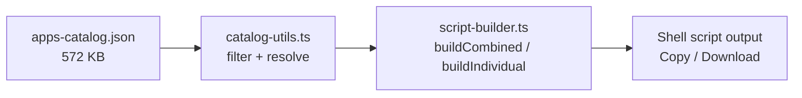

# dev.tools — Tool Reference

Documentation for all 24 tool pages in the dev.tools suite.

---

## Dashboard

The landing page listing all available tools.

**Technical**

- Route: `/`
- Pattern: Custom
- Key source files:
    - `src/pages/index.tsx`

---

## String Utils

Transform and clean text with 20+ operations — change case (camelCase, snake_case, PascalCase, kebab-case, CONSTANT_CASE, Title Case, sentence case), slugify, trim/normalize whitespace, and line operations (sort, deduplicate, reverse, shuffle, split/join by delimiter). Paste or open a file on the left, pick an operation from the searchable middle panel, and read the result on the right; use **⇄ Use as input** to chain transforms. Everything runs locally in your browser.

**Technical**

- Route: `/string-utils`
- Pattern: ToolView
- Key source files:
    - `src/common/utils-factory.ts` → `createStringUtilList()`

---

## JSON Formatter

Format, inspect and query JSON. Beautify with 2/4/Tab indentation, minify, sort keys recursively, validate with a live valid/invalid badge and error position, and escape/unescape JSON strings. The **Query (JSONPath)** mode evaluates expressions like `$.items[*].id` and shows the matched values. Parsing is done with the browser's native JSON engine — nothing leaves your machine.

**Technical**

- Route: `/json-formatter`
- Pattern: ToolView
- Key source files:
    - `src/common/utils-factory.ts` → `createJsonFormatterList()`
    - `src/common/json-query.ts`

---

## XML Formatter

**Technical**

- Route: `/xml-formatter`
- Pattern: ToolView
- Key source files:
    - `src/common/xml-formatting-tools.ts`

---

## Hashing Tools

Compute cryptographic digests of text or a file — **MD5, SHA-1, SHA-256, SHA-384, SHA-512** — all at once in a results table with one-click copy and an uppercase-hex toggle. SHA family uses the browser's WebCrypto; MD5 uses a bundled library. Drag a file in or paste text; large files are hashed from their bytes. Fully offline.

**Technical**

- Route: `/hashing-tools`
- Pattern: ToolView
- Key source files:
    - `src/common/utils-factory.ts` → `createHashingUtils()`

---

## Encoding Tools

Encode and decode text between common formats: **Base64** (standard and URL-safe), **URL/percent** encoding, and **HTML entities**. Encode/decode are paired so you can round-trip, and **⇄ Use as input** lets you chain conversions (e.g. URL-decode then Base64-decode). Client-side only.

**Technical**

- Route: `/encoding-tools`
- Pattern: ToolView
- Key source files:
    - `src/common/utils-factory.ts` → `createEncodingDecodingUtilList()`

---

## Terminal Utils

Build a single shell command from many lines. Paste commands (one per line), pick the target syntax (**Unix bash / Windows bat / PowerShell**), and join them with **`&`** (run sequentially) or **`&&`** (stop on first failure) into one copy-paste-ready line. Useful for turning a setup checklist into a single command.

**Technical**

- Route: `/terminal-utils`
- Pattern: Editor
- Key source files:
    - `src/pages/terminal-utils/index.tsx` (inline logic)

---

## Code Editor

A full Monaco (VS Code) editor for quick edits and snippets, with open/save, copy/paste, word-wrap and minimap toggles, a cursor/line status bar, and language selection for 10 common languages inline plus the full Monaco list. The **Format** button pretty-prints the buffer where a formatter exists (JS/TS/JSON/HTML/CSS/Markdown, SQL, XML). All editing is local.

**Technical**

- Route: `/code-editor`
- Pattern: Editor
- Key source files:
    - `src/common/format-code.ts`

---

## Markdown Tools

Write Markdown on the left and see a live, GitHub-flavored preview on the right — with tables, math (KaTeX), syntax-highlighted code, and **embedded Mermaid diagrams**. Toggle the editor/preview panes, word-wrap and minimap; **Print / Export to PDF**; open and save `.md` files. Renders entirely in the browser.

**Technical**

- Route: `/markdown-tools`
- Pattern: Editor
- Key source files:
    - `react-markdown` + remark/rehype plugins

---

## Mermaid Editor

**Technical**

- Route: `/mermaid-editor`
- Pattern: Editor
- Key source files:
    - `mermaid` library

---

## Diff

**Technical**

- Route: `/diff`
- Pattern: Custom
- Key source files:
    - `src/common/diff-normalizer.ts`

---

## HTML Editor

**Technical**

- Route: `/html-editor`
- Pattern: Editor
- Key source files:
    - `src/pages/html-editor/index.tsx` (inline preview rendering)

---

## JWT

**Technical**

- Route: `/jwt`
- Pattern: Custom
- Key source files:
    - `src/common/jwt-utils.ts`

---

## Cron

**Technical**

- Route: `/cron`
- Pattern: Custom
- Key source files:
    - `src/common/cron-utils.ts`

---

## QR

**Technical**

- Route: `/qr`
- Pattern: Custom
- Key source files:
    - `src/common/qr-utils.ts`

---

## Converting Tools

Convert between representations in four modes: **number base** (DEC/HEX/BIN/OCT and any base 2–36), **data format** (JSON ↔ YAML ↔ TOML ↔ CSV ↔ **Markdown table**), **color** (HEX ↔ RGB ↔ HSL ↔ HSV with a swatch), and **units** (data sizes, time, temperature, length). Live, bidirectional, with per-row copy.

> Note: This route exists but is currently disabled in the sidebar.

**Technical**

- Route: `/converting-tools`
- Pattern: Custom
- Key source files:
    - `src/common/converting/` (directory)

---

## Date Tools

Work with dates two ways: **Timestamp ↔ date** (Unix seconds/ms ↔ formatted date, timezone and format selectors, "Now", and a breakdown with day-of-week, day-of-year and ISO week) and **Duration between dates** (total / working / weekend days, weeks, months, years between two dates). All computed locally.

> Note: This route exists but is currently disabled in the sidebar.

**Technical**

- Route: `/date-tools`
- Pattern: Custom
- Key source files:
    - `src/common/date-utils.ts`

---

## Software Installer

Generate **install / update / upgrade / remove** scripts for a catalog of 160+ apps across macOS, Windows and Linux. Pick a platform (and Linux distro), choose preferred package managers, select apps (with per-app method override and multi-version JDKs), then build a single resilient script per action or bare one-line commands per app — copy or download. The catalog and scripts are generated client-side; nothing is installed by this tool.

**Technical**

- Route: `/software-installer`
- Pattern: Custom
- Key source files:
    - `src/common/apps-catalog.json`
    - `src/common/script-builder.ts`
    - `src/common/catalog-utils.ts`

**Installer data flow**

---

## macOS Setup

Get a Mac ready for development: install **Homebrew**, configure your shell `PATH`/profile, and run platform-specific scripts (including the **Apple Silicon VRAM Manager** for local LLMs). App installation lives in the Software Installer. Each step is a copyable command.

**Technical**

- Route: `/mac-os-setup`
- Pattern: Custom
- Key source files:
    - `src/common/macos-utils.ts`
    - `src/common/vram-script-generator.ts`

---

## Windows Setup

Set up Windows package managers — **winget**, **Chocolatey**, **Scoop** — and configure environment variables. Copy the PowerShell commands for the manager you prefer. App installation lives in the Software Installer.

**Technical**

- Route: `/windows-setup`
- Pattern: Custom
- Key source files:
    - `src/common/windows-utils.ts`

---

## Linux Setup

Enable package managers per distro family (**apt / dnf / pacman / zypper**) plus **Flatpak** and **Snap**, and set shell environment variables. Pick your distro and copy the commands. App installation lives in the Software Installer.

**Technical**

- Route: `/linux-setup`
- Pattern: Custom
- Key source files:
    - `src/common/linux-utils.ts`

---

## Git Cheat-sheet

Configure Git, SSH and GPG either interactively (fill name/email/OS → generated commands) or with a manual step-by-step guide covering install, identity, SSH keys, and GPG commit signing, with links to GitHub/GitLab docs. Copy any block.

**Technical**

- Route: `/git-cheat-sheet`
- Pattern: Custom
- Key source files:
    - `src/common/git-utils.ts`

---

## LLM VRAM Calculator

Estimate the memory needed to run a local GGUF model. Enter **parameters and quantization** (the two main inputs) for an instant estimate and a "fits on" device table; open **Advanced** for GPU type, VRAM/OS, context and KV-cache settings, architecture, MoE and inference engine. Covers effective-bpw quant sizing, KV-cache, engine overhead and partial offload. Estimates only.

**Technical**

- Route: `/llm-vram-calculator`
- Pattern: Custom
- Key source files:
    - `src/common/llm-vram-calc.ts` (1412 lines)

---

## Prompts Collection

Browse prompts organized by domain and category. Fill editable parameters — predefined picks or free text — switch between chat and agent variants, copy filled prompts or raw templates, and share stable deep links. Includes a browse-all catalog and a skills library with per-agent install guides and file downloads.

Views:

- **Domain/Category browser** (`/prompts-collection?domain=X&category=Y`) — tabbed domain → category → prompt list → detail panel
- **Catalog** (`/prompts-collection?view=catalog`) — flat, searchable list of all prompts
- **Skills** (`/prompts-collection?type=skills`) — packaged agent skills with file downloads

**Technical**

- Route: `/prompts-collection`
- Pattern: Custom
- Key source files:
    - `src/common/prompts/catalog/` — TypeScript prompt modules (source of truth)
    - `scripts/build-prompts.mjs` — validates catalog and emits manifest + loaders
    - `src/common/prompts/loader.ts` — runtime loading API (loadManifest / loadCategory / loadSkill)
    - `src/common/prompts/data.ts` — data-access selectors over loaded data
    - `src/components/page-specific/prompts-collection/PromptsCollectionView.tsx` — main view component

---

## All Routes Summary

| Tool                | Route                  | Pattern  | Key source files                                                                                               |
| ------------------- | ---------------------- | -------- | -------------------------------------------------------------------------------------------------------------- |
| Dashboard           | `/`                    | Custom   | `src/pages/index.tsx`                                                                                          |
| String Utils        | `/string-utils`        | ToolView | `src/common/utils-factory.ts` → `createStringUtilList()`                                                       |
| JSON Formatter      | `/json-formatter`      | ToolView | `src/common/utils-factory.ts` → `createJsonFormatterList()`, `src/common/json-query.ts`                        |
| XML Formatter       | `/xml-formatter`       | ToolView | `src/common/xml-formatting-tools.ts`                                                                           |
| Hashing Tools       | `/hashing-tools`       | ToolView | `src/common/utils-factory.ts` → `createHashingUtils()`                                                         |
| Encoding Tools      | `/encoding-tools`      | ToolView | `src/common/utils-factory.ts` → `createEncodingDecodingUtilList()`                                             |
| Terminal Utils      | `/terminal-utils`      | Editor   | inline logic in `src/pages/terminal-utils/index.tsx`                                                           |
| Code Editor         | `/code-editor`         | Editor   | `src/common/format-code.ts`                                                                                    |
| Markdown Tools      | `/markdown-tools`      | Editor   | `react-markdown` + remark/rehype plugins                                                                       |
| Mermaid Editor      | `/mermaid-editor`      | Editor   | `mermaid` library                                                                                              |
| Diff                | `/diff`                | Custom   | `src/common/diff-normalizer.ts`                                                                                |
| HTML Editor         | `/html-editor`         | Editor   | inline preview rendering                                                                                       |
| JWT                 | `/jwt`                 | Custom   | `src/common/jwt-utils.ts`                                                                                      |
| Cron                | `/cron`                | Custom   | `src/common/cron-utils.ts`                                                                                     |
| QR                  | `/qr`                  | Custom   | `src/common/qr-utils.ts`                                                                                       |
| Converting Tools    | `/converting-tools`    | Custom   | `src/common/converting/` (disabled in sidebar)                                                                 |
| Date Tools          | `/date-tools`          | Custom   | `src/common/date-utils.ts` (disabled in sidebar)                                                               |
| Software Installer  | `/software-installer`  | Custom   | `src/common/apps-catalog.json`, `src/common/script-builder.ts`, `src/common/catalog-utils.ts`                  |
| macOS Setup         | `/mac-os-setup`        | Custom   | `src/common/macos-utils.ts`, `src/common/vram-script-generator.ts`                                             |
| Windows Setup       | `/windows-setup`       | Custom   | `src/common/windows-utils.ts`                                                                                  |
| Linux Setup         | `/linux-setup`         | Custom   | `src/common/linux-utils.ts`                                                                                    |
| Git Cheat-sheet     | `/git-cheat-sheet`     | Custom   | `src/common/git-utils.ts`                                                                                      |
| LLM VRAM Calculator | `/llm-vram-calculator` | Custom   | `src/common/llm-vram-calc.ts` (1412 lines)                                                                     |
| Prompts Collection  | `/prompts-collection`  | Custom   | `src/common/prompts/catalog/` → `scripts/build-prompts.mjs` → `manifest.generated.ts` + `loaders.generated.ts` |
